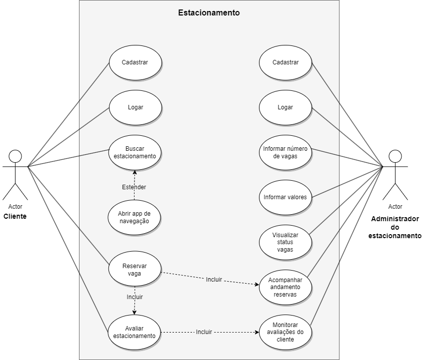
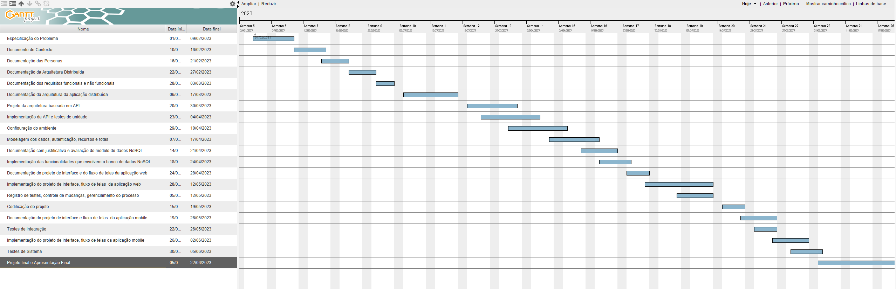
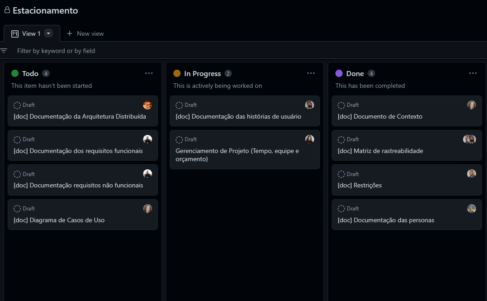

# Especificações do Projeto

Pré-requisitos: <a href="1-Documentação de Contexto.md"> Documentação de Contexto</a>

Definição do problema e ideia de solução a partir da perspectiva do usuário. É composta pela definição do  diagrama de personas, histórias de usuários, requisitos funcionais e não funcionais além das restrições do projeto.

Apresente uma visão geral do que será abordado nesta parte do documento, enumerando as técnicas e/ou ferramentas utilizadas para realizar a especificações do projeto

## Personas

## Histórias de Usuários

Com base na análise das personas forma identificadas as seguintes histórias de usuários:

|EU COMO... `PERSONA`| QUERO/PRECISO ... `FUNCIONALIDADE`                                          |PARA ... `MOTIVO/VALOR`                                              |
|--------------------|-----------------------------------------------------------------------------|---------------------------------------------------------------------|
| José Henrique      | Encontrar uma vaga de estacionamento disponível próximo ao meu destino      | Economizar tempo e não me atrasar para as minhas reuniões           |
| Maria Júlia        | Encontrar estacionamentos mais baratos e próximas ao meu destino            | Economizar dinheiro e tempo e chegar às minhas aulas pontualmente   |
| Fernando Azevedo   | Controlar a ocupação do meu estacionamento e receber feedback dos clientes  | Tomar decisões mais assertivas sobre o meu negócio                  |
| Isabela Senna      | Difundir melhor as promoções do meu estacionamento e alcançar mais clientes | Economizar dinheiro e tempo e chegar às minhas aulas pontualmente   |
| Maria Júlia        | Ajudar os clientes a localizarem meu estacionamento facilmente              | Possa aumentar a visibilidade do meu negócio e atrair mais clientes |

## Casos de Uso

De acordo com o perfil e as histórias das personas mencionadas no item anterior, foram identificados os seguintes casos de uso:

* Realizar cadastro de usuário cliente (UC-01);
* Realizar cadastro de empresa de estacionamento (UC-02);
* Efetuar busca por estacionamentos próximos a localização (UC-03);
* Efetuar reserva de vaga em um estacionamento (UC-4);
* Avaliação após a utilização de um estacionamento (UC-05);
* Realizar cadastro de vagas de estacionamento no sistema (UC-06);
* Informar valores das vagas com base no tempo de permanência e/ou tipo de veículo (UC-07);
* Visualizar status das vagas cadastradas (UC-08);
* Acompanhar o andamento das reservas (UC-09);
* Monitorar as avaliações dos clientes (UC-10).

## Requisitos

Nesta parte serão listados os requisitos funcionais (RF) e não funcionais (RNF), onde os requisitos funcionais descrevem a interação dos usuários com o sistema, e os requisitos não funcionais descrevem as funcionalidades do sistema de uma forma geral.

### Requisitos Funcionais (RF)

A tabela a seguir apresenta os requisitos do projeto, identificando a sua prioridade em que os mesmos devem ser entregues.

|  ID      | Descrição do Requisito  | Prioridade |
|----------|-----------------------------------------|----|
|RF 01   | O sistema deve permitir ao cliente a criação de um cadastro, informando apenas nome, e-mail e senha, no aplicativo mobile. | ALTA |
|RF 02    | O sistema deve permitir ao cliente que possui cadastro, fazer o login no aplicativo mobile.  | ALTA |
|RF 03    | O sistema deve permitir ao administrador de estacionamento realizar um cadastro, informando apenas nome fantasia, CNPJ, e-mail e senha na aplicação Web. | ALTA |
|RF 04    | O sistema deve permitir ao administrador que tem cadastro fazer o login na aplicação Web | ALTA |
|RF 05    | O sistema deve notificar o cliente do aplicativo mobile quando houver um estacionamento perto da sua localização. | ALTA |
|RF 06    | O sistema deve apresentar um mecanismo de busca que permita ao cliente localizar estacionamentos cadastrados que possuam vagas para estacionamento imediato de acordo com sua localização.| ALTA |
|RF 07    | O sistema deve permitir ao cliente a reserva de vaga no estacionamento a sua escolha. | MÉDIA |
|RF 08    | O sistema deve permitir ao administrador informar quantas vagas possui o seu estacionamento, bem como o valor por hora e/ou tipo de veículo. | MÉDIA |
|RF 09    | O sistema deve permitir a partir da geolocalização, que o cliente seja redirecionado ao aplicativo de navegação do dispositivo móvel. | ALTA |
|RF 10    | O sistema deve permitir que o cliente avalie e comente sobre a experiência no estacionamento. | MÉDIA |
|RF 11    | O sistema deve permitir ao administrador visualizar o status das vagas cadastradas para o seu estacionamento. | ALTA |
|RF 12    | O sistema deve permitir ao administrador acompanhar o andamento das reservas atuais e programadas. | MÉDIA |
|RF 13    | O sistema deve permitir o monitoramento de avaliações e comentários dos usuários sobre o seu negócio. | MÉDIA |

### Requisitos não Funcionais (RNF)

A tabela a seguir apresenta os requisitos não funcionais que o projeto deverá atender e suas prioridades.

|ID       | Descrição do Requisito  |Prioridade |
|-------  |-------------------------|----|
|RNF 01| O sistema deverá utilizar banco de dados relacional (MySQL) e não relacional (FireBase). | MÉDIA |
|RNF 02| O sistema deverá utilizar o Apache Kafka para transmissão de dados. | MÉDIA |
|RNF 03| O aplicativo mobile deverá ser compatível com diversos sistemas operacionais, como iOS e Android. | ALTA |
|RNF 04| A aplicação Web deve conter tecnologias e versões adaptadas para ser renderizada nos navegadores mais usados (Google Chrome, Microsoft Edge, Firefox, Safari). | ALTA |
|RNF 05| O back-end deve ser desenvolvido conforme o padrão REST. | ALTA |

## Restrições

O projeto está restrito pelos itens apresentados na tabela a seguir.

|ID| Restrição                                                          |
|--|--------------------------------------------------------------------|
|01| O projeto deverá ser entregue até o final do semestre              |
|02| A aplicação deve ser desenvolvida com base em sistemas distribuídos|
|03| A equipe não pode subcontratar o desenvolvimento do trabalho       |
|04| O projeto deverá ter seu código versionado utilizando git          |

## Modelagem do Processo de Negócio 

### Análise da Situação Atual

Apresente aqui os problemas existentes que viabilizam sua proposta. Apresente o modelo do sistema como ele funciona hoje. Caso sua proposta seja inovadora e não existam processos claramente definidos, apresente como as tarefas que o seu sistema pretende implementar são executadas atualmente, mesmo que não se utilize tecnologia computacional. 

### Descrição Geral da Proposta

Apresente aqui uma descrição da sua proposta abordando seus limites e suas ligações com as estratégias e objetivos do negócio. Apresente aqui as oportunidades de melhorias.

### Processo 1 – NOME DO PROCESSO

Apresente aqui o nome e as oportunidades de melhorias para o processo 1. Em seguida, apresente o modelo do processo 1, descrito no padrão BPMN. 

### Processo 2 – NOME DO PROCESSO

Apresente aqui o nome e as oportunidades de melhorias para o processo 2. Em seguida, apresente o modelo do processo 2, descrito no padrão BPMN.

## Indicadores de Desempenho

Apresente aqui os principais indicadores de desempenho e algumas metas para o processo. Atenção: as informações necessárias para gerar os indicadores devem estar contempladas no diagrama de classe. Colocar no mínimo 5 indicadores. 

Usar o seguinte modelo: 

Obs.: todas as informações para gerar os indicadores devem estar no diagrama de classe a ser apresentado a posteriori. 

## Diagrama de Casos de Uso

O diagrama de casos de uso representado a seguir difine a sequência de ações dos atores, seus relacionamentos e sua interações com o sistema:

# Matriz de Rastreabilidade

A matriz de rastreabilidade é uma ferramenta usada para facilitar a visualização dos relacionamento entre requisitos e outros artefatos ou objetos, permitindo a rastreabilidade entre os requisitos e os objetivos de negócio. 

# Gerenciamento de Projeto

O gerenciamento de projeto permitirá que a equipe entenda claramente o escopo do projeto, estabeleça um cronograma realista e gerencie os recursos, riscos e custos ao longo do processo de desenvolvimento.

## Gerenciamento de Tempo

O gráfico de Gantt ou diagrama de Gantt é uma ferramenta visual utilizada para controlar e gerenciar o cronograma de atividades de um projeto. 

## Gerenciamento de Equipe

O gerenciamento de tarefas será realizado através do GitHub Projects. A seguir o quadro de trabalho atual:

## Gestão de Orçamento

O processo de determinar o orçamento do projeto é uma tarefa que depende, além dos produtos (saídas) dos processos anteriores do gerenciamento de custos, também de produtos oferecidos por outros processos de gerenciamento, como o escopo e o tempo.

|Recursos Necessários    | R$  |
|------------------------|-----|
|Programadores| 30000,00   (30/hora*) |
|Designer UX| 16000,00 |
|Servidores| 1200,00   (100/mês**) |
|Loja Google| 128,69    |
|Loja Apple| 515,78   (515,78/ano**) |
|Total| 47844,47 |

*Cálculos realizados considerando 1000 horas de desenvolvimento.  
**Cálculos realizados para o primeiro ano de produção, tendo em vista que os valores mensais e anuais de servidores e App Store continuarão a serem cobrados.

