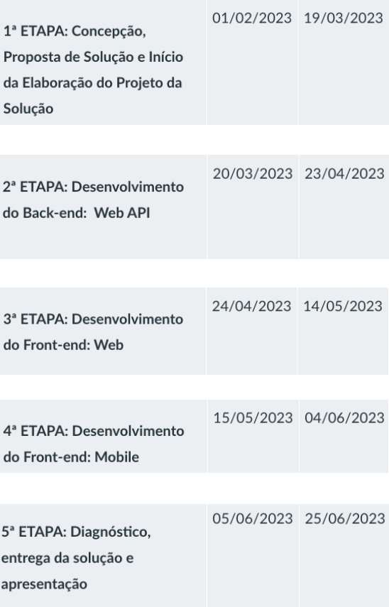
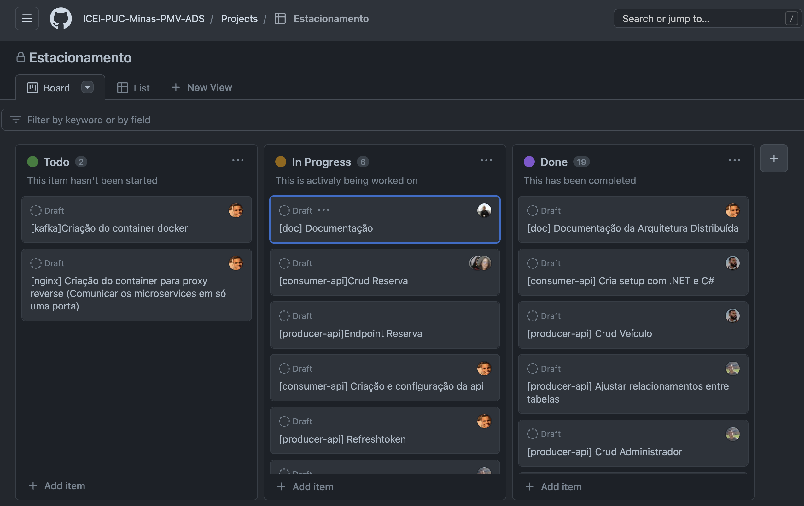

# Metodologia

## Controle de Versão

A ferramenta de controle de versão adotada no projeto foi o
[Git](https://git-scm.com/), sendo que o [Github](https://github.com)
foi utilizado para hospedagem do repositório.

O projeto segue a seguinte convenção para o nome de branches:

- `main`: versão estável já testada do software
- `feature`: uma nova funcionalidade precisa ser introduzida
- `develop`: versão de desenvolvimento do software

Quanto à gerência de issues, o projeto adota a seguinte convenção para
etiquetas:

- `doc`: melhorias ou acréscimos à documentação
- `bug`: uma funcionalidade encontra-se com problemas

### Configuração do Projeto

O grupo escolheu utilizar um processo baseado em GitFlow para administrar a gestão do código. Desta forma, é possível separarmos as etapas de cada estágio da evolução e correção do software, mas com cada etapa em sua própria branch. Sendo elas: Main, Develop e Feature.

## Gerenciamento de Projeto

|Ambiente                          | Plataforma  | Link de acesso|
|----------------------------------| ----------- | --------------|
|Repositório de código fonte       | GitHub      | <https://github.com/ICEI-PUC-Minas-PMV-ADS/pmv-ads-2023-1-e4-proj-infra-t3-estacionamentoeixo4> |
|Documentos de Projeto             | Google Docs | <https://docs.google.com/document/d/1NAYYys4jxpt1EowTOEwGRViP7hqgUyDXGHmdKfqDz3g/edit> |
|Gerenciamento do Projeto          | GitHub Projects      | <https://github.com/orgs/ICEI-PUC-Minas-PMV-ADS/projects/276> |

### Divisão de Papéis

A escolha do grupo para o gerenciamento do projeto foi a metodologia ágil Scrum.

A equipe está organizada da seguinte maneira:
* Scrum Master: Leonardo Vilela Cardoso
* Product Owner: Júlio Sergio Novaes Gomes
* Equipe de Desenvolvimento:
    * Jhonata Jackson Monteiro Motta
    * Paulo Henrique Costa Santos
    * Isabela Pinheiro Santos
    * Kaio Henrik de Paula Silva
    * Meriane dos Reis Dias
    * Thiago Roberto de Souza  

Para organização e distribuição das tarefas do projeto, a equipe está utilizando o modelo Projects dentro do próprio GitHub estruturado com as seguintes listas:
* Backlog: recebe as tarefas a serem trabalhadas e representa o Product Backlog. 
* Todas as atividades identificadas no decorrer do projeto também devem ser incorporadas a esta lista.
* To Do: Esta lista representa o Sprint Backlog. Este é o Sprint atual que estamos trabalhando.
* In Progress: Quando uma tarefa tiver sido iniciada, ela é movida para cá.
* Done: nesta lista são colocadas as tarefas que passaram pelos testes e controle de qualidade e estão prontos para ser entregues ao usuário. Não há mais edições ou revisões necessárias, ele está agendado e pronto para a ação.

O quadro Projects do grupo está disponível através da URL <https://github.com/orgs/ICEI-PUC-Minas-PMV-ADS/projects/276/views/1>

### Processo

O plano de sprint utilizado para guiar o grupo foi utilizado seguindo o sugerido pela própria instituição da PUC, conforme mostrado abaixo:

Plano seguido para todas etapas do desenvolvimento do projeto:
 

Após ter sido feita a análise das informações acima, desenvolvemos todo o gerenciamento do projeto no próprio GitHub através da ferramenta Projects, conforme mostrado abaixo:

### Ferramentas

As ferramentas empregadas no projeto são:

- Editor de código.
- Ferramentas de comunicação

O editor de código foi escolhido porque ele possui uma integração com o sistema de versão. As ferramentas de comunicação utilizadas possuem integração semelhante e por isso foram selecionadas. Por fim, para criar diagramas utilizamos essa ferramenta por melhor captar as necessidades da nossa solução.

Liste quais ferramentas foram empregadas no desenvolvimento do projeto, justificando a escolha delas, sempre que possível.
 
> **Possíveis Ferramentas que auxiliarão no gerenciamento**: 
> - [Slack](https://slack.com/)
> - [Github](https://github.com/)
