# Projeto de Interface

A elaboração da interface do sistema web e mobile priorizam a simplicidade e focam em agilidade, acessibilidade e usabilidade

## Diagrama de Fluxo - Web

O diagrama abaixo mostra uma visão geral da interação do usuário (administrador do estacionamento) pelas telas do sistema:

As principais interfaces da plataforma são:

* Home: tela principal da aplicação
* Tela de cadastro: permite que o administrador do estacionamento faça o seu cadastro na aplicação, de forma simples, RF-03;
* Tela de login: permite que o administrador faça o login no sistema, caso já tenha o cadastro, conforme RF-04;
* Tela "Dashboard": permite ao administrador do estacionamento a utilização das funcionalidades do sistema, quais sejam: cadastrar vagas no estacionamento, com valor e hora (RF-08), visualisar as reservas feitas (RF-09), acompanhar o status das reservas (RF-12), além de monitorar as avaliações e comentários sobre o estacionamento, feitos pelos clientes (RF-13).

O diagrama foi pensado de forma a atender a todas as histórias de usuários abordadas.

## Wireframe - Web

A estrutura da aplicação web será da seguinte forma: 

(Tela - Home)
 
 

(Tela - Login)
 
 

(Tela - Cadastro)
 
 

(Tela - Dashboard)

## Diagrama de Fluxo - Mobile

## Wireframe - Mobile
A estrutura da aplicação mobile será da seguinte forma:
 

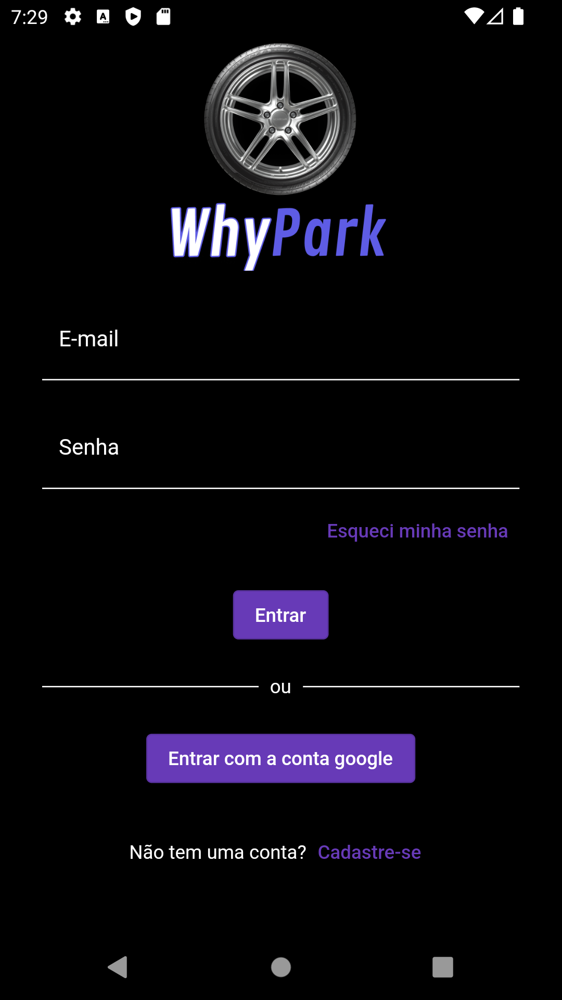   

(Tela - Login)
 
 
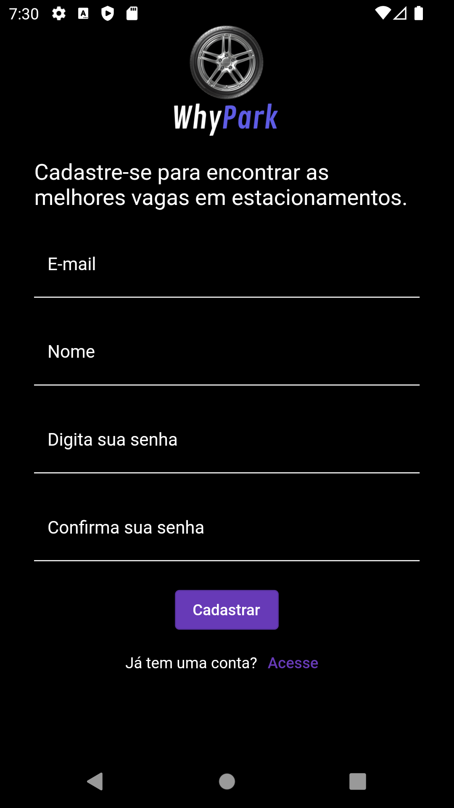   
(Tela - Cadastro)
 
 
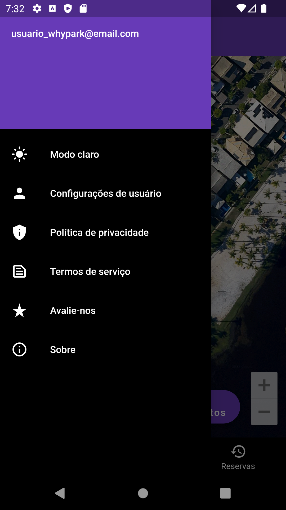   
(Tela - Menu)
 
 
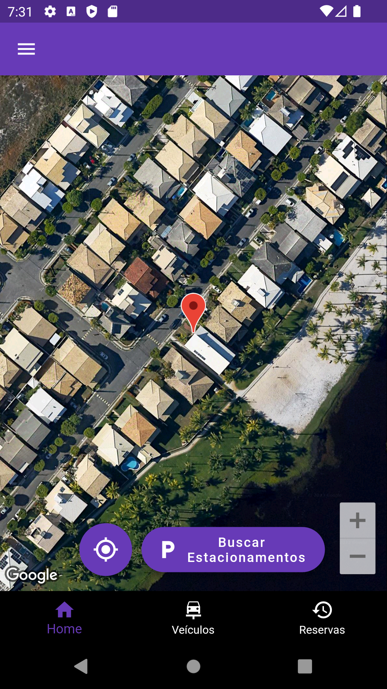   
(Tela - Principal)
 
 
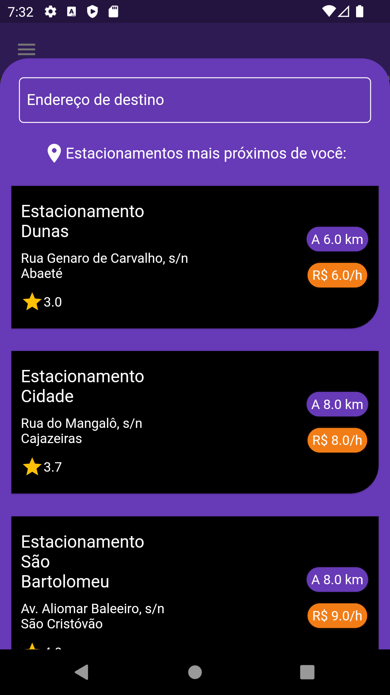   
(Tela - Busca por Estacionamentos)
 
 
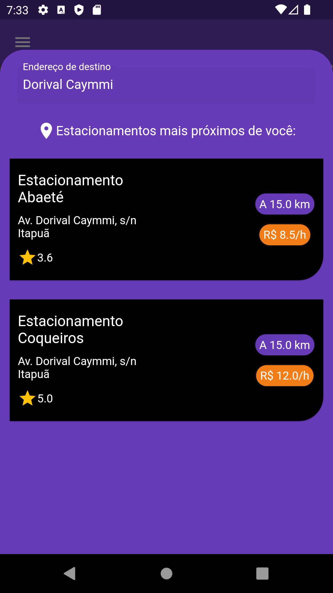   
(Tela - Consulta por Endereço)
 
 
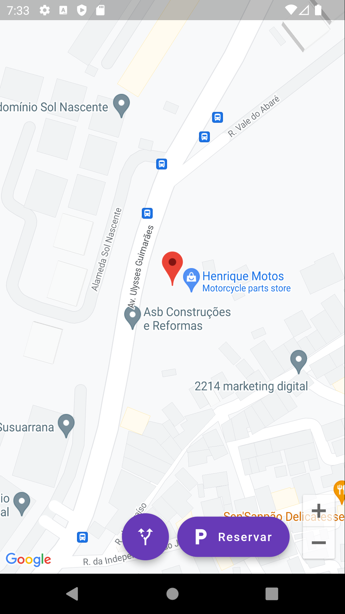   
(Tela - Mapa)
 
 
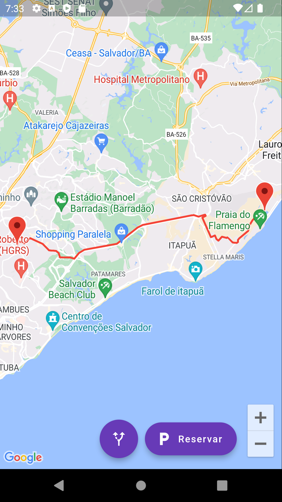   
(Tela - Rota)
 
 
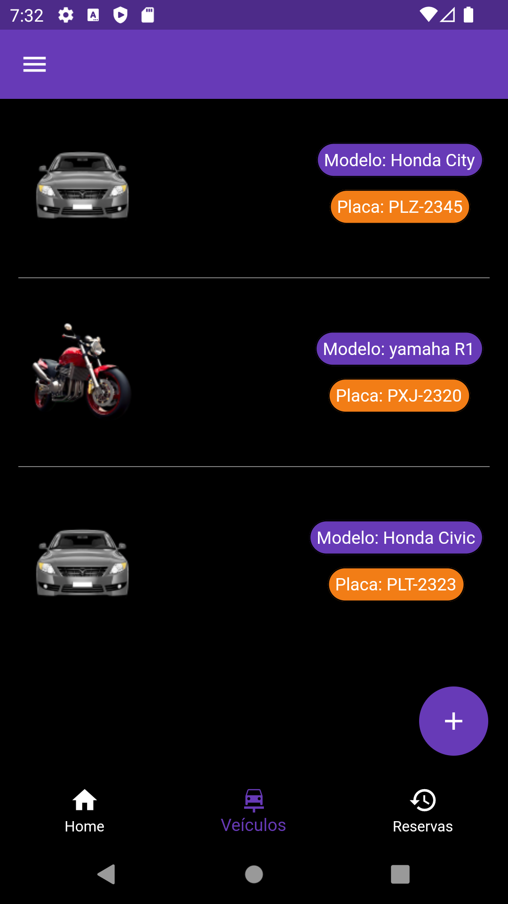   
(Tela - Veículos)
 
 
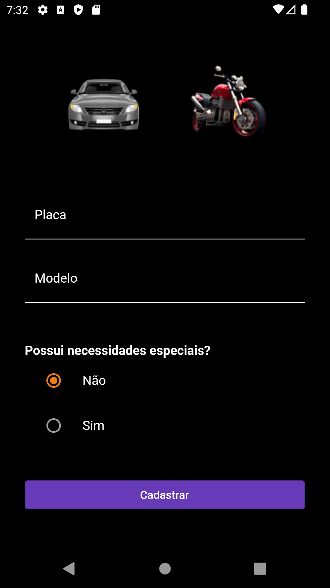   
(Tela - Cadastrar veículo)
 
 
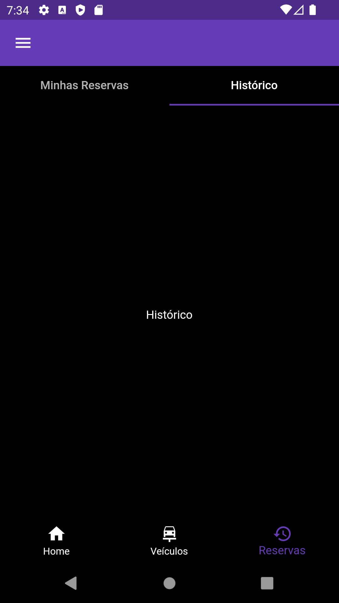   
(Tela - Histórico)
 
 
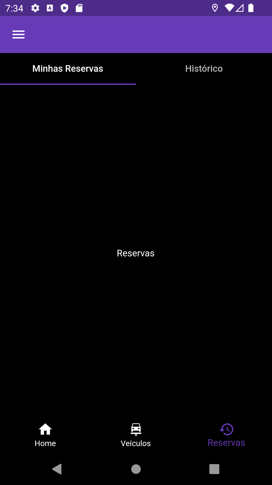   
(Tela - Reservas)
 
 
