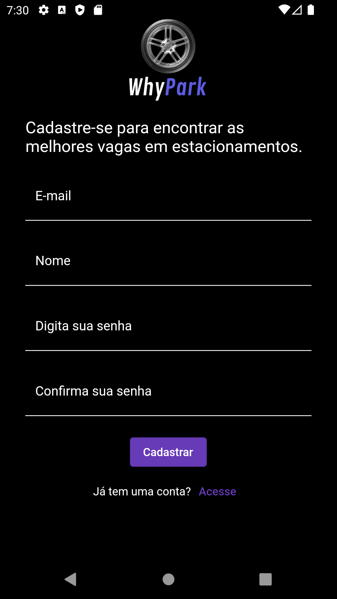
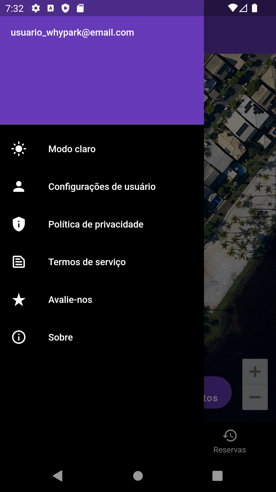
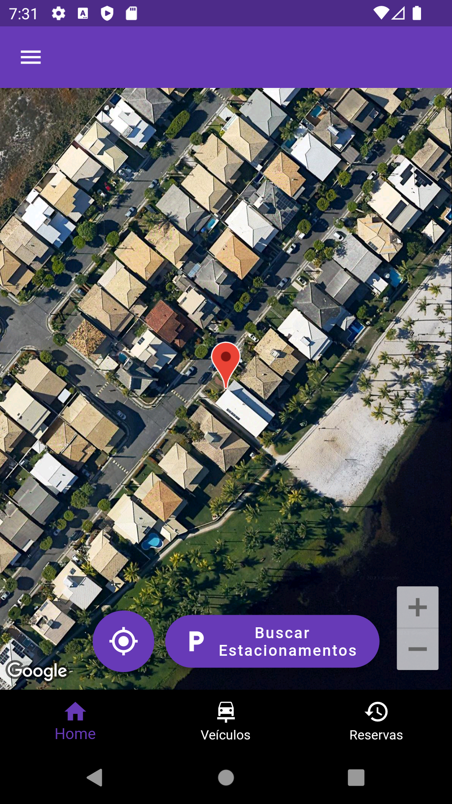
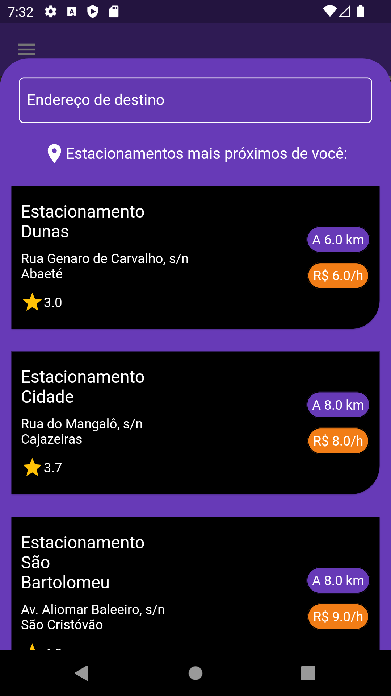
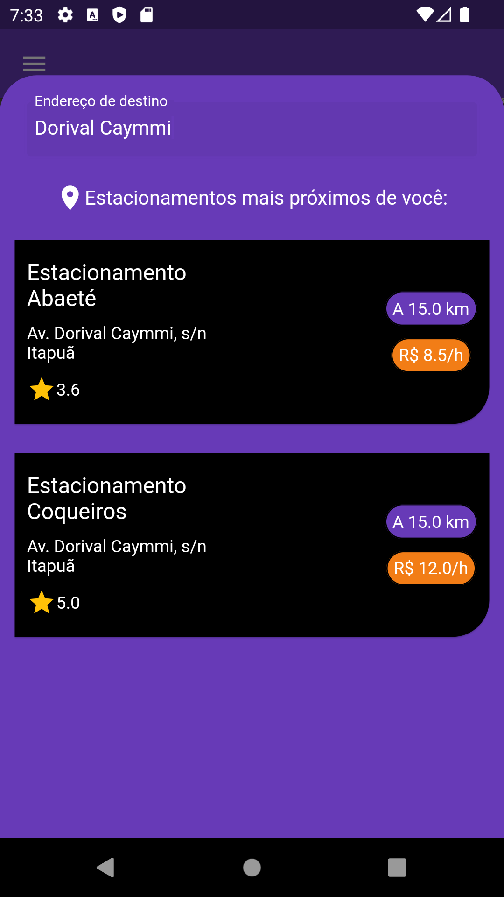
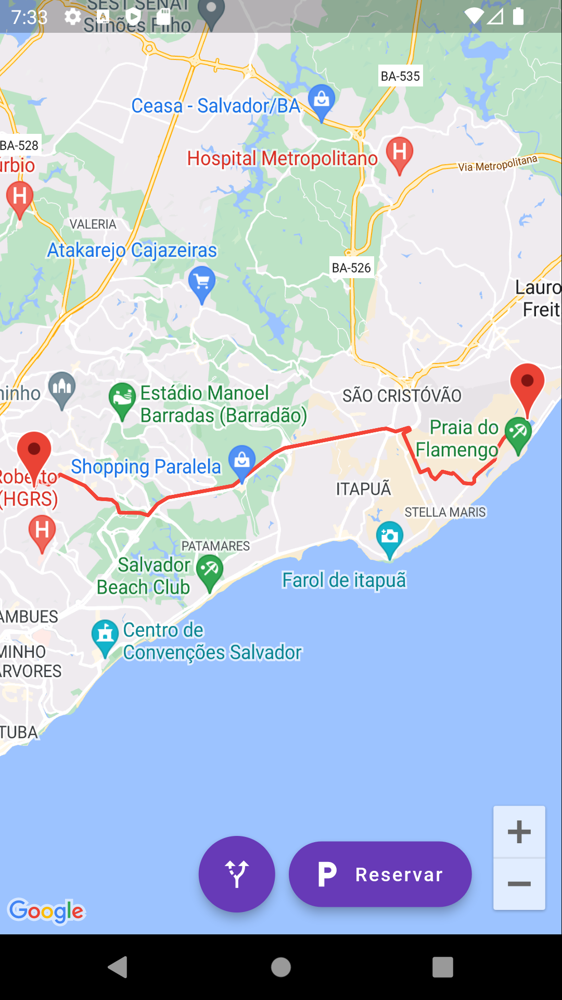
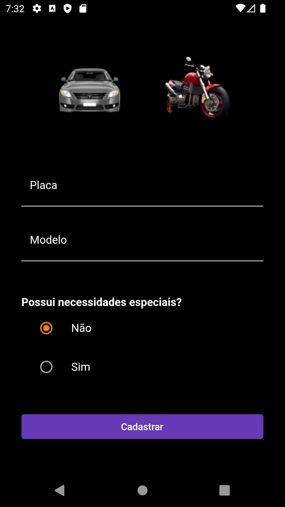
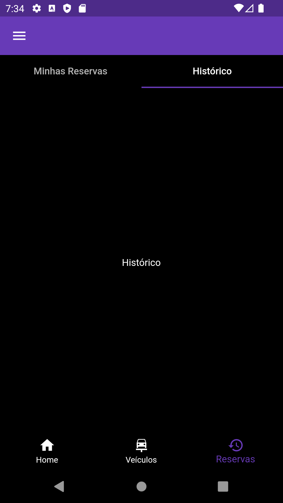

# Template Padrão da Aplicação - Web

O template padrão a ser utilizado corresponde ao modelo de wireframe interativo proposto, disponível no tópico "Projeto de Interface". Será adotado um layout padrão, que será utilizado em todas as telas do aplicativo móvel.

## Tela - Home

Tela apresentada ao usuário antes de efetuar o login. 

## Tela - Login

Tela apresentada ao usuário que já tem cadastro no sistema. Caso não tenha, será apresentada opção para fazer, redirecionando para a tela de cadastro. 
O login será feito com o preenchimento dos campos e-mail e senha. O botão "Entrar", ao final dos campos, redireciona para a tela de dashboard. 

## Tela - Cadastro

Para fazer o cadastro, basta o usuário informar os seus dados e selecionar o botão "Criar conta" abaixo dos campos. Todos os campos do formulário deverão ser preenchidos. Também possui o link clicável "Login", que irá redirecionar o usuário de volta à tela de Login, caso já tenha uma conta cadastrada com os dados informados.

## Tela - Dashboard

Tela que será exibida ao usuário que tiver cadastro no sistema. Por meio dela é que será feito o controle do estacionamento (vagas, reservas, avaliações dos clientes, etc).

# Template Padrão da Aplicação - Mobile

## Tela - Login
   

Tela apresentada ao usuário que já tem cadastro no sistema. Caso não tenha, será apresentada opção para fazer, redirecionando para a tela de cadastro. O login será feito com o preenchimento dos campos e-mail e senha. O botão "Entrar", ao final dos campos, redireciona para a tela do menu principal.
 
 

## Tela - Cadastro
   

Para fazer o cadastro, basta o usuário informar os seus dados e selecionar o botão "Cadastrar" abaixo dos campos. Todos os campos do formulário deverão ser preenchidos. Também possui o link clicável "Acesse", que irá redirecionar o usuário de volta à tela de Login, caso já tenha uma conta cadastrada com os dados informados.
 
 

## Tela - Menu
  

O menu contém algumas configurações do aplicativo, como por exemplo *Modo da Tela* (dark ou light), *Configurações de Usuário*, *Política de privacidade*, *Termos de serviço*, *Avaliação do aplicativo* e *Sobre* (informações do aplicativo). Pode ser usado para acessar algumas dessas funções acima citadas. 
 
 

## Tela - Principal
   

A tela principal contém um mapa para visualização e uma opção para *Buscar Estacionamentos* de acordo com um endereço indicado na página de busca.
 
 

## Tela - Busca por Estacionamentos
 
    

A tela de busca por estacionamentos é onde o usuário digita o *Endereço de destino* e o aplicativo retorna os estacionamentos cadastrados de acordo com a proximidade do local indicado. É a página onde o usuário seleciona o estacionamento desejado.

 
 

## Tela - Mapa
   

Tela de visualização do local em que se encontra o estacionamento desejado através de um mapa.
Ao clicar na opção *Reservar* o usuário será redirecionado para a tela de rota.
 
 

## Tela - Rota
   

A tela de rota traça a distância média em que se encontra o estacionamento desejado.
 
 

## Tela - Cadastrar veículo
   

A tela de cadastro é onde o usuário insere todas as informações do veículo necessárias para a efetuação da reserva.
 
 

## Tela - Veículos
   

A tela veículos é onde usuário visualiza os veículos cadastrados e adiciona através do símbolo *+* um novo veículo.
 
 

## Tela - Histórico
   

Tela para visualização do histórico de reservas efetuadas pelo usuário.
 
 

## Tela - Reservas
  

Tela para efetuar a reserva de uma nova vaga.
 
 
