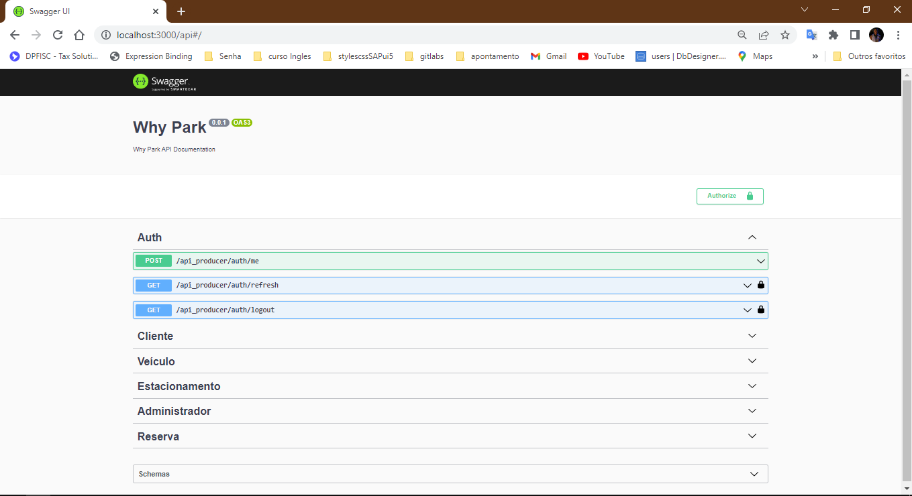
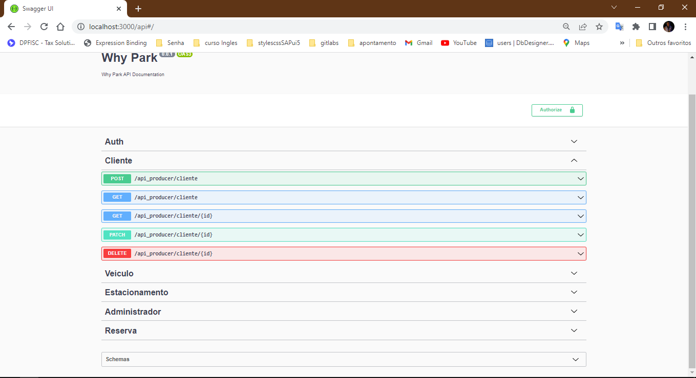
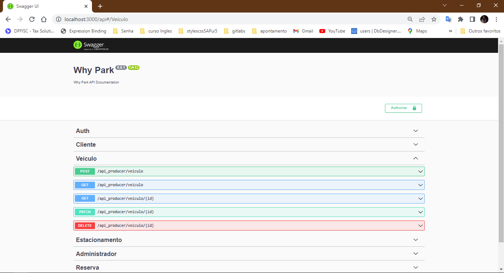
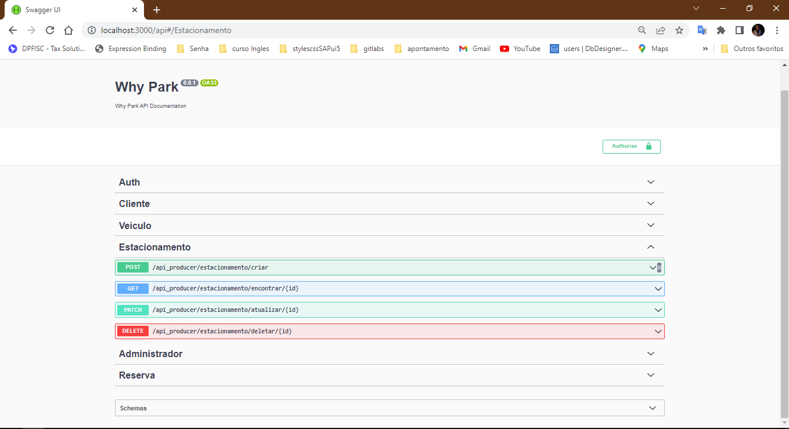
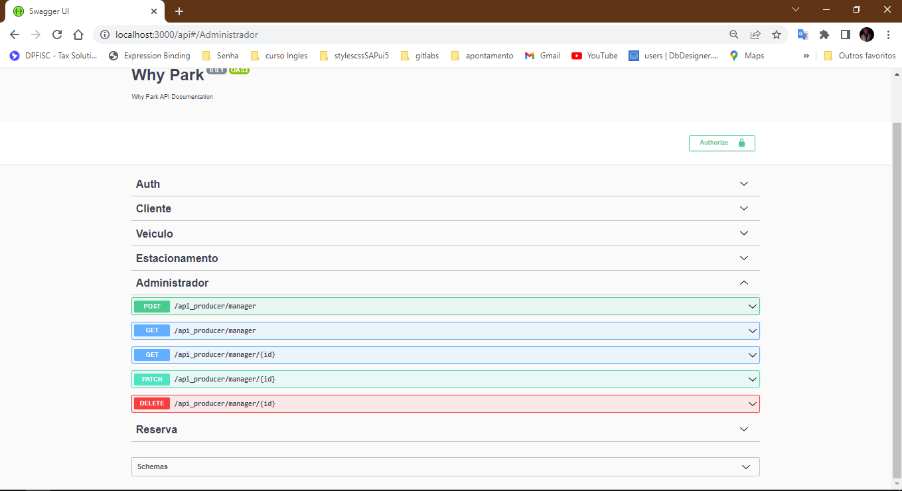
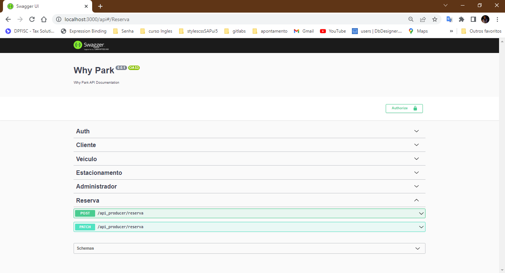
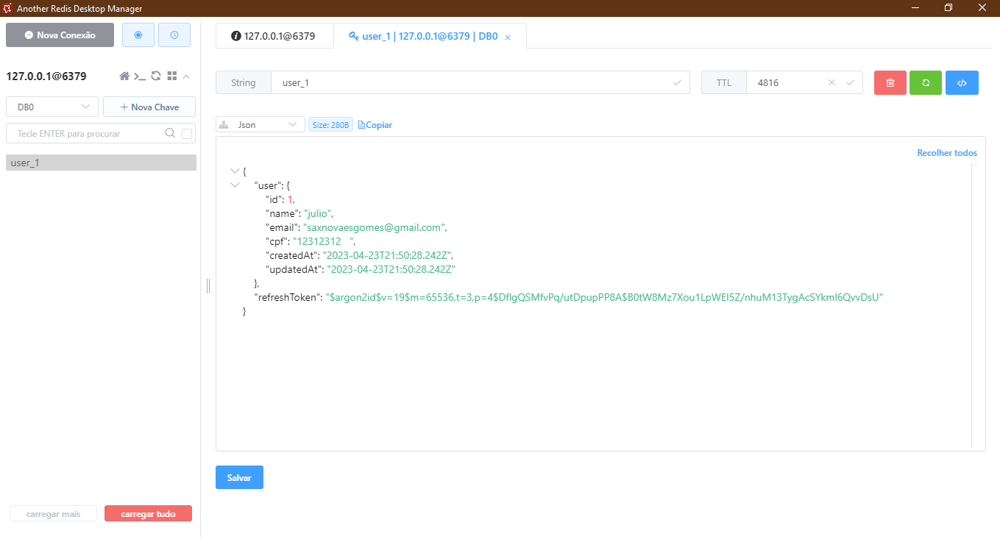

# Programação de Funcionalidades

# Implementação da Web API Rest, aplicativo mobile e outras configurações

## Rotas

`A rota da Auth foi criada para complementar a autenticação feita pelo Front End em Firebase
`

`A rota Cliente foi criada para lidar com a transação dos dados de um dos usuários finais`

`A rota Veiculo foi criada para lidar com a transação dos dados relacionado ao veículo do usuário 
`

`A rota Estacionamento foi criada para lidar com a transação dos dados relacionado pela reserva feita pelo cliente 
`

`A rota Administrador foi criada para lidar com a transação dos dados relacionado a um dos usuários finais 
`

`A rota Reserva foi criada para lidar com as transaçôes dos dados feitas pelos usuarios finais atráves de microservicos de mensageria em busca de escalabilidade e segurança 
`

## Implementação das funcionalidades que envolvem o banco de dados NoSQL

`
  O grupo decidiu seguir com o Redis pela flexibilidade de um banco NoSQl e também por resolver o problema de cache com os dados de autenticação dos usuários   
`

## Implementação da autenticação
`
O Firebase Authentication foi utilizado para autenticar usuários no aplicativo:
`

# Implementação do banco de dados SQL

`O grupo optou por utilizar o PostgreSQL como banco de dados relacional. Na imagem abaixo é possível visualizar algumas tabelas do banco:`

