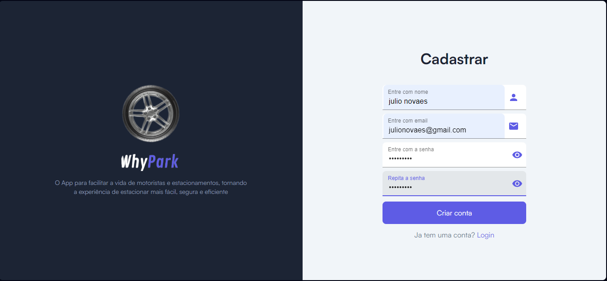

## Registro de Testes de Software

|  Caso de teste | Descrição  | Resultado |
| :------------: | :------------ |:------------: |
| CT-01 |  Cadastramento de estacionamento  | Sucesso|
| CT-02 |  Login da aplicação | Sucesso|
| CT-03 |  Vagas disponíveis | Sucesso|
| CT-04 |  Status de vagas | Sucesso|
| CT-05 |  Monitoramento de vagas  | Sucesso|

## CT-01- Cadastramento de estacionamento

## CT-02- Cadastro do administrador/Login

## CT-03- Vagas disponíveis

## CT-04- Status de vagas

## CT-05- Monitoramento de vagas

## Avaliação

Todos os testes foram executados com sucesso conforme o plano de teste proposto. Tanto o front-end, quando o back-end tiveram uma boa integração para que os resultados fossem alcançados.

