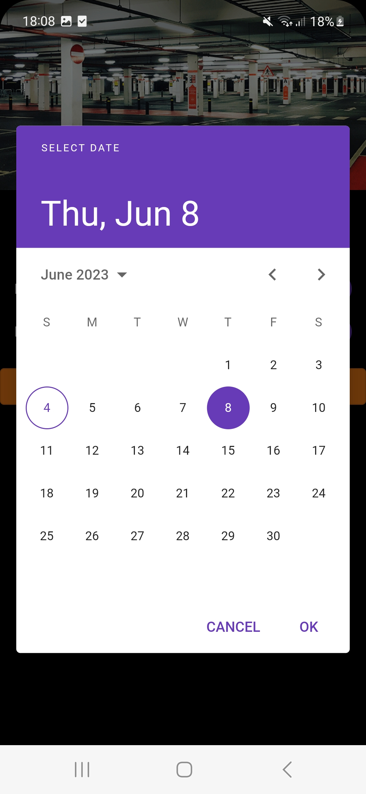
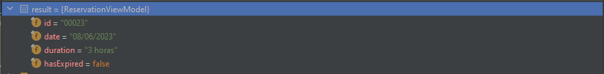
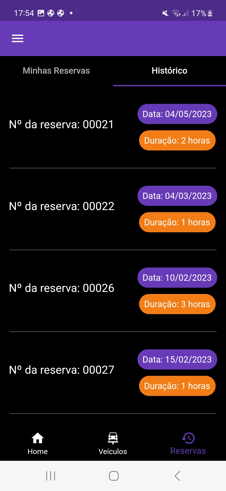
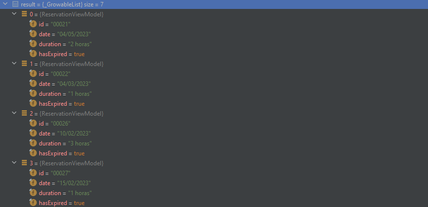

## Registro de Testes de Software

|  Caso de teste | Descrição  | Resultado |
| :------------: | :------------ |:------------: |
| CT-01 |  Cadastro de estacionamento  | Sucesso|
| CT-02 |  Login da aplicação | Sucesso|
| CT-03 |  Vagas disponíveis | Sucesso|
| CT-04 |  Status de vagas | Sucesso|
| CT-05 |  Monitoramento de vagas  | Sucesso|
| CT-06 |  Cadastro de usuário  | Sucesso|
| CT-07 |  Cadastro de veículo  | Sucesso|
| CT-08 |  Veículo cadastrado  | Sucesso|
| CT-09 |  Cadastro de reserva  | Sucesso|
| CT-10 |  Visualização de reservas  | Sucesso|
| CT-11 |  Visualização de reservas  | Sucesso|

## CT-01- Cadastro de estacionamento

## CT-02- Cadastro do administrador/Login

## CT-03- Vagas disponíveis

## CT-04- Status de vagas

## CT-05- Monitoramento de vagas

## CT-06- Cadastro de usuário

|Tela 1| Tela 2|
|--------|---------|
||||

## CT-07- Cadastro de veículo

|Tela 1| Tela 2|
|--------|---------|
|||

## CT-08-Veículo cadastrado

|Tela 1| Tela 2|
|--------|---------|
|||

## CT-09-Cadastro de reserva

|Tela 1| Tela 2|
|--------|---------|
|||

## CT-10-Visualização de reservas

|Tela 1| Tela 2|
|--------|---------|
|||

## CT-11-Busca por estacionamentos próximos

## Avaliação

Todos os testes foram executados com sucesso conforme o plano de teste proposto. Tanto o front-end, quando o back-end tiveram uma boa integração para que os resultados fossem alcançados.

