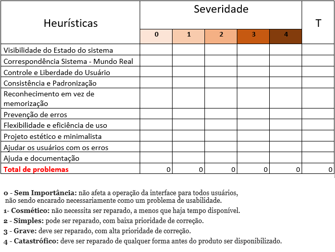

# Plano de Testes de Usabilidade
## Avaliação Dinâmica

> - Objetivo do teste: Avaliar a usabilidade do software  

> - Quando e onde o teste será executado: Online 

> - Tempo de duração para cada sessão de teste: 20 minutos 

> - Estado em que o software deve estar no início do teste: Fase de protótipo (em construção) 

> - Usuários envolvidos no teste: Administradores de estacionamento 

 
> - Tarefas definidas para que os administradores executem com sucesso

### Realizar os procedimentos das seguintes funcionalidades:  

1)  *Cadastrar estacionamento* : Verificar se ao inputar os dados na página de cadastro, os dados darão acesso ao sistema, podendo assim acessar o controle do estacionamento. 

2)  *Login da aplicação* : Verificar na página de login, se após inserir os dados do administrador, ele terá acesso ao sistema de controle de estacionamento.

3)  *Vagas disponíveis* : Exibir para o administrador as informações sobre a quantidade de vagas disponíveis e seus valores. 

4)  *Status de vagas* : Verificar na página de informações sobre o status de vagas disponíveis e
    após visualização dos dados, o administrador deve ser capaz de controlar a disponibilidade de vagas.
	  
5)  *Monitoramento de vagas* : Verificar na página de consultar, o andamento das reservas atuais e programadas, podendo assim disponibilizar mais ou menos vagas para os usuários.

6) *Cadastro de usuário* : Verificar se ao inserir os dados na página de cadastro, estes dados darão acesso ao sistema e o usuário poderá assim utilizar as funcionalidades do aplicativo mobile.

7) *Login do usuário*: Verificar na página de login se, após inserir os dados pedidos no cadastro, o usuário receberá acesso às funcionalidades do aplicativo mobile.

7) *Cadastro de veículos* : Verificar se o usuário com cadastro consegue também cadastrar seu(s) veículos(s) no sistema do aplicativo, ao inserir os dados na página de cadastro de veículo.

8) *Veículo cadastrado* : Exibir para o usuário o(s) veículos(s) que ele possui cadastrado no aplicativo.

9) *Buscar estacionamento* : Exibir para o usuário a opção de busca de estacionamento, com a possibilidade de buscar por estacionamentos próximos ao endereço de destino informado.

9) *Reserva de vaga* : Exibir para o usuário a opção de prosseguir com a reserva após a busca de um estacionamento pela localização informada e a confirmação da reserva.

10) *Visualização de reservas* : Exibir para o usuário as reservas ativas.

11) *Histórico* : Exibir para o usuário o histórico de todas as reservas já feitas por ele no aplicativo mobile.

## Dados que serão coletados durante os testes: 

Serão avaliados por nota, de acordo com as seguintes métricas: 

Nota 1-  Péssimo (refazer funcionalidade) 

Nota 2-  Ruim (refazer uma parte da funcionalidade) 

Nota 3-  Mediano (alterações pontuais) 

Nota 4-  Muito bom (experimentar e iterar) 

Nota 5-  Excelente (pronto para testar em produção) 

&nbsp;

## Avaliação Estática (Heuríticas de Nielsen)

Teste de Usabilidade (Heurísticas)

De uma forma geral, a heurística tem como objetivo reduzir a carga cognitiva do usuário, diminuindo o tempo de tomada de decisão fazendo com que as experiências sejam mais apropriadas e menos cansativas.

**1- Visibilidade do status do sistema**

Manter o usuário informado sobre o que acontece no momento da interação, podendo mostrar por exemplo quantos itens restam para completar o cadastro.

**2-Correspondência entre o sistema e o mundo real**

O reconhecimento de objetos e ícones que são familiares é muito importante para experiência do usuário, que fale a linguagem mais próxima de sua realidade, ícones como o símbolo de telefone ou uma carta que representa o e-mail.

**3-Liberdade e controle do usuário**

Considerando que o usuário pode tomar uma ação errada ou se arrepender da decisão que tomou, o sistema pode lhe dar a opção de voltar ou mesmo mostrar um aviso sobre à ação que será feita.

**4-Consistência e padrões**

Manter uma mesma linguagem durante toda a interface para não confundir o usuário, portanto, durante a interação, os usuários não devem ter dúvidas sobre o significado das palavras, ícones ou símbolos utilizados, é fundamental que uma interface mantenha padrões de interação em diversos contextos.

**5-Prevenção de erros**

Para prevenirmos que o usuário não se frustre ao ter os arquivos deletados, é importante criar uma mensagem de aviso da ação, para que haja a confirmação ou não da decisão.

**6- Reconhecer ao invés de lembrar**

O usuário não deve ter que se lembrar de todas as ações ou funções da interface é importante sempre deixar à disposição pequenos lembretes das informações que podem ser úteis a ele, como um símbolo de interrogação e ao clicar irá mostrar alguma informação.

**7-Flexibilidade e eficiência**

A interface desenvolvida precisa ser útil e atender tanto aos usuários inexperientes quanto aos experiêntes.

**8-Estética e Design minimalista**

A interface deve conter diálogos que contenham somente informações relevantes. Ou seja, evitar o uso desnecessário de elementos visuais que possam confundir o usuário.

**9-Auxiliar usuários a reconhecer, diagnosticar e recuperar erros**

É muito importante ajudar o usuário a identificar e encontrar soluções para os problemas e erros encontrados durante a interação. As mensagens de erro devem ser mostradas em uma linguagem simples, sem códigos, clara e que indique precisamente o problema e sugira uma solução.

**10- Ajuda e documentação**

Pode ser necessário fornecer documentação para ajudar os usuários a entender como concluir suas tarefas. O conteúdo de ajuda e documentação deve ser fácil de pesquisar e focado na tarefa do usuário.

Abaixo a *tabela* mostra como realizar um teste de usabilidade atrvés de pontuação.

